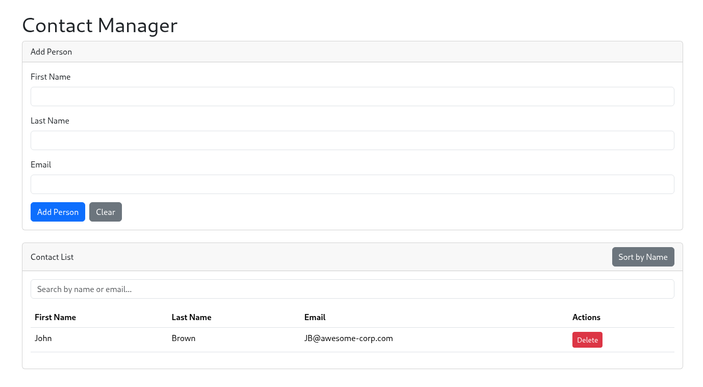

# Three-Tier Architecture (Modernized)

A simple three-layer Java application using SQLite database management system, modernized to a Java 21 and Spring Boot backend with a React frontend.

# Description

The original project was a JavaFX application with a SQLite database. This modernized version migrates the backend to Java 21 and Spring Boot, and replaces the JavaFX frontend with a modern, responsive React application.

## Modernized Architecture

The modernized application is split into two main directories:

*   `src-21`: Contains the Java 21 Spring Boot backend, with a multi-module Maven setup for the application, business logic, and data access layers.
*   `frontend`: Contains the React frontend, built with Bootstrap for styling.

# Features
 - [x] Add file (person's info) to database
 - [x] Search file in the database
 - [x] View the database in table format
 - [x] Delete specific entry in the database
 - [x] Validates form entries
 - [ ] Datepicker
 - [ ] Scrollable country list 
 - [ ] Create a new database file
 - [ ] Display search in a table format
 - [ ] Implement (edit,copy,etc) to allow modification

# Usage

To run the modernized application, you will need to start both the backend and the frontend.

## Backend

1.  Navigate to the `src-21/contact-manager` directory.
2.  Run `mvn spring-boot:run -pl contact-manager-app`.

## Frontend

1.  Navigate to the `frontend` directory.
2.  Run `npm install` to install the dependencies.
3.  Run `npm start` to start the development server.

# Demo

## Original Application

Primary Scene (Login):

Main Scene (Add new info, search, delete, view database, etc):

Database:

## Modernized Application

Web UI:

