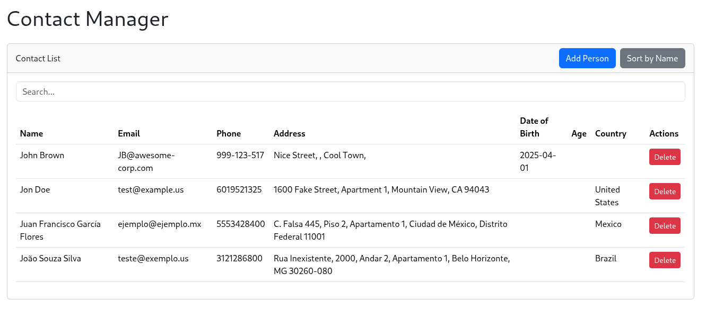
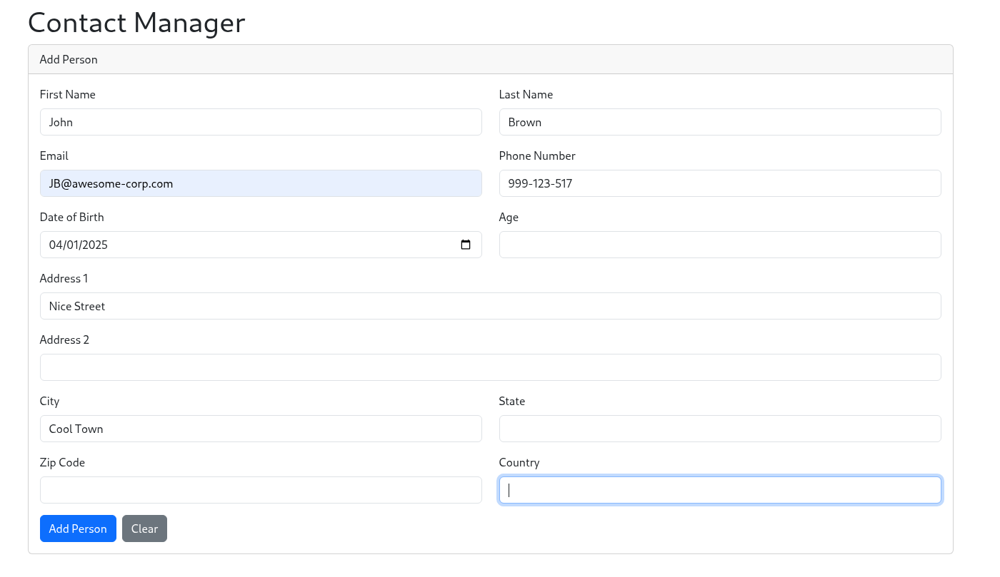

# Three-Tier Architecture (Modernized)

A simple three-layer Java application using SQLite database management system, modernized to a Java 21 and Spring Boot backend with a React frontend.

# Description

The original project was a JavaFX application with a SQLite database. This modernized version migrates the backend to Java 21 and Spring Boot, and replaces the JavaFX frontend with a modern, responsive React application.

## Our Modernization Journey

This modernization was orchestrated by the Gemini CLI 🤖, following a structured, test-driven methodology. The process began with a thorough analysis of the legacy application, resulting in a detailed modernization plan. Key recommendations included replacing the JavaFX UI with a React-based web application and upgrading the database from SQLite to PostgreSQL.

Gemini then migrated the application feature by feature, adhering to a strict Test-Driven Development (TDD) cycle 🧪. A significant challenge was encountered with the multi-module Maven configuration for integration tests. However, by leveraging online documentation, the agent successfully resolved the configuration and implemented robust integration tests with Testcontainers.

The final phase involved building the React frontend, delivering the modern, responsive user interface showcased in the demo.

## Modernized Architecture

The modernized application is split into two main directories:

*   `src-21`: Contains the Java 21 Spring Boot backend, with a multi-module Maven setup for the application, business logic, and data access layers.
*   `frontend`: Contains the React frontend, built with Bootstrap for styling.

## Legacy vs. Modern ✨

This project represents a significant technological leap:

-   **From Desktop to Web** 🌐: The original JavaFX application was a classic desktop app. The new version is a modern web application, accessible from any browser.
-   **Backend Evolution** 🚀: The backend logic was migrated from standard Java to the powerful Spring Boot framework, enabling robust REST APIs and easier dependency management with Maven.
-   **UI/UX Transformation** 🎨: The frontend was completely rebuilt from JavaFX to React. This provides a more dynamic, responsive, and user-friendly interface, styled with Bootstrap for a clean look.
-   **Database Upgrade** 💾: The self-contained SQLite database has been replaced with a more scalable and feature-rich PostgreSQL database, managed via Testcontainers for reliable integration testing.

This modernization not only brings the application to the web but also introduces a more maintainable and scalable architecture, aligning with current industry best practices.

# Features
 - [x] Add file (person's info) to database
 - [x] Search file in the database
 - [x] View the database in table format
 - [x] Delete specific entry in the database
 - [x] Validates form entries
 - [ ] Datepicker
 - [ ] Scrollable country list 
 - [ ] Create a new database file
 - [ ] Display search in a table format
 - [ ] Implement (edit,copy,etc) to allow modification

# Usage

To run the modernized application, you will need to start both the backend and the frontend.

## Backend

1.  Navigate to the `src-21/contact-manager` directory.
2.  Run `mvn spring-boot:run -pl contact-manager-app`.

## Frontend

1.  Navigate to the `frontend` directory.
2.  Run `npm install` to install the dependencies.
3.  Run `npm start` to start the development server.

# Demo

## Modernized Application

Web UI:

Contact List:

Add Person:

## Original Application

Primary Scene (Login):

Main Scene (Add new info, search, delete, view database, etc):

Database:

