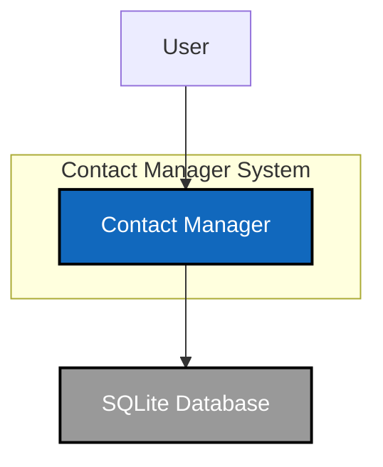
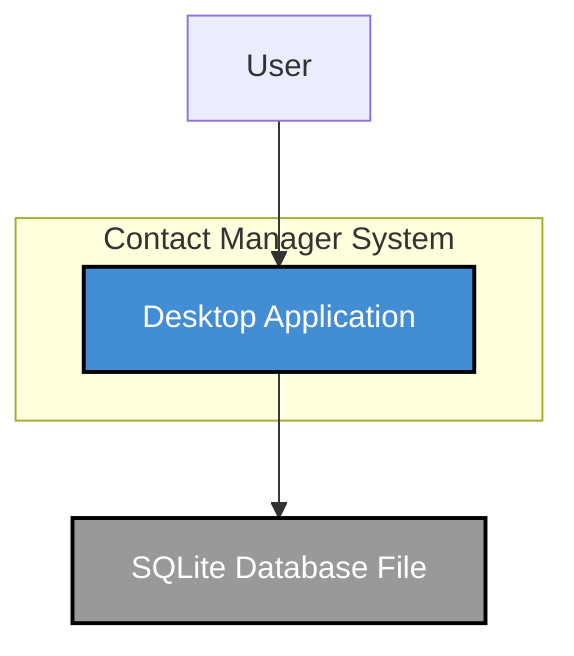
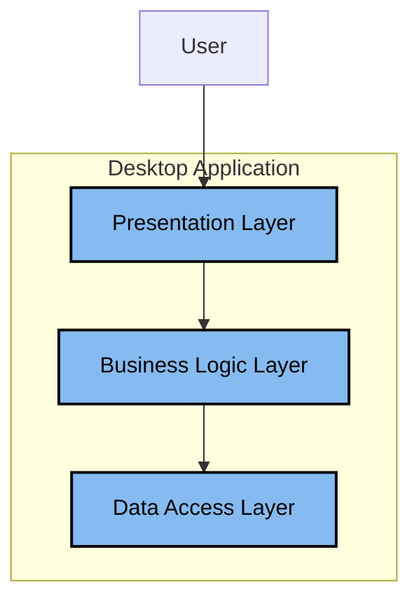
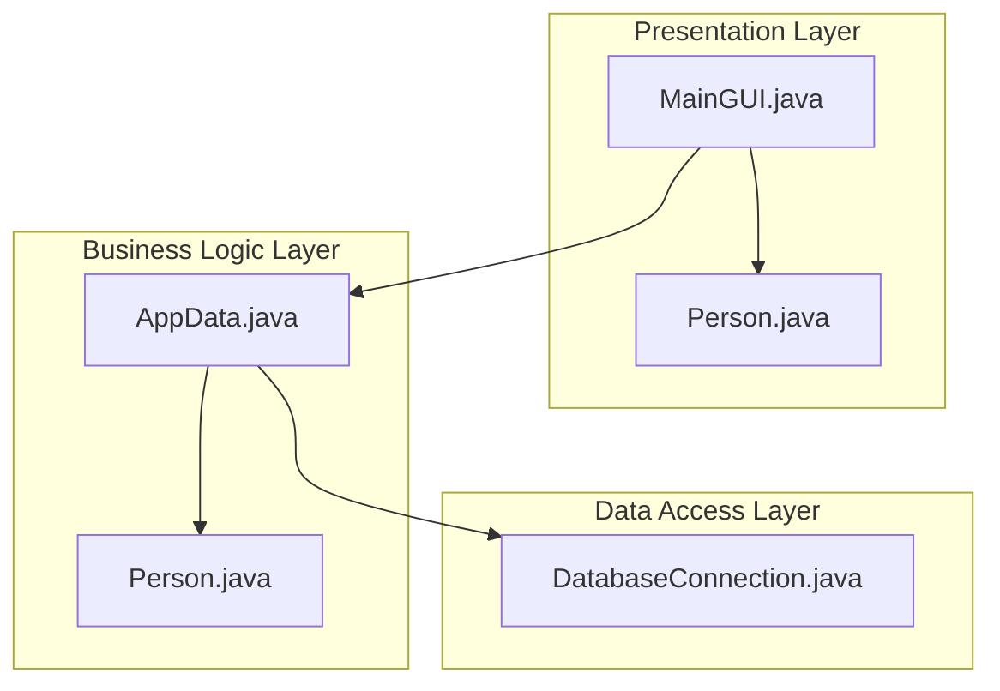

# C4 Architecture Documentation

This document outlines the architecture of the legacy `ContactManager` application using the C4 model. The diagrams are rendered using Mermaid syntax.

## Level 1: System Context

The System Context diagram shows the application as a black box and its interactions with users and other systems.

| Element           | Description                                                                 |
|-------------------|-----------------------------------------------------------------------------|
| **User**          | A person who uses the Contact Manager application to manage contact information. |
| **Contact Manager** | The desktop application being documented.                                   |
| **SQLite Database** | The local database file used by the application to store contact data.      |

---

## Level 2: Containers

The Container diagram zooms into the system boundary to show the high-level technical building blocks.

| Container                | Description                                                                                             | Technology         |
|--------------------------|---------------------------------------------------------------------------------------------------------|--------------------|
| **Desktop Application**  | A standalone JavaFX desktop application that provides all the functionality for managing contacts.      | Java 8, JavaFX     |
| **SQLite Database File** | A local file on the user's machine that stores the contact data in an SQLite database format.           | SQLite             |

---

## Level 3: Components

The Component diagram breaks down the "Desktop Application" container into its key components.

| Component                | Description                                                                                             | Package Name        |
|--------------------------|---------------------------------------------------------------------------------------------------------|---------------------|
| **Presentation Layer**   | Provides the user interface for interacting with the application.                                       | `application`       |
| **Business Logic Layer** | Contains the core application logic and data models.                                                    | `businesslayer`     |
| **Data Access Layer**    | Manages the connection to the database and executes SQL queries.                                        | `datalayer`         |

---

## Level 4: Code

The Code diagram shows the main classes within each component and their interactions.

| Class                       | Description                                                                                             |
|-----------------------------|---------------------------------------------------------------------------------------------------------|
| `application.MainGUI`       | The main JavaFX class that builds and manages the user interface.                                       |
| `application.Person`        | A data model class with JavaFX properties for UI data binding.                                          |
| `businesslayer.AppData`     | A singleton class that acts as a facade for the business logic, handling all CRUD operations.           |
| `businesslayer.Person`      | A POJO (Plain Old Java Object) representing the core `Person` data model.                               |
| `datalayer.DatabaseConnection` | A utility class for creating and managing the JDBC connection to the SQLite database.                   |
